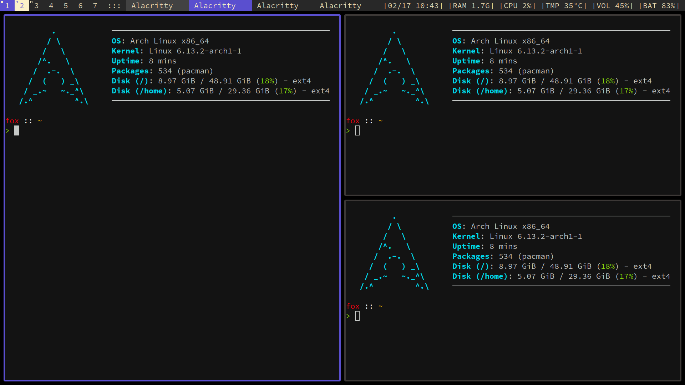

# DWM - dynamic window manager

**DWM** is an extremely fast, small, and dynamic window manager for X.  
This is a fork of DWM, customized with patches and personal preferences.  
Official **suckless.org** dwm: [https://dwm.suckless.org](https://dwm.suckless.org).  
A list of patches used in this build can be found in [patches_list.txt](patches_list.txt).  
For my status bar, terminal setup, and other dotfiles, check out my [dotfiles repository](https://github.com/Sora-Fox/dotfiles).  

## Installation

```sh
git clone --depth=1 https://github.com/Sora-Fox/dwm.git
sudo make -C dwm -j${nproc} install
```

## Screenshots



## Keybindings & Programs

| **Program**         | **Description**          | **Keybinding**                         |
|---------------------|--------------------------|----------------------------------------|
| `dmenu`             | Application launcher     | `Mod + R`                              |
| `pactl`             | Volume control           | `F1`, `F2`, `F3`                       |
| `brightnessctl`     | Brightness control       | `F5`, `F6`                             |
| `flameshot`         | Screenshots              | `PrtSc` (area), `Shift + PrtSc` (full) |
| `diodon`            | Clipboard manager        | `Mod + V`                              |
| `alacritty`         | Terminal Emulator        | `Mod + Enter`                          |

